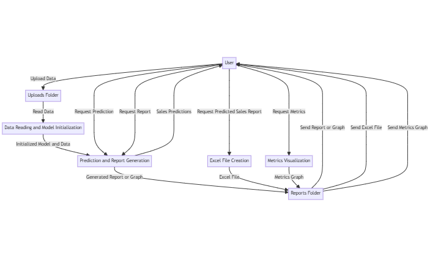

# Sales Prediction Flask Application

This Flask application predicts sales using a linear regression model and provides various functionalities, including generating reports and visualizations.

## Features

- **Sales Prediction**: Predict sales for a given month and year.
- **Report Generation**: Generate bar graphs, dotted line graphs, or combined graphs based on historical sales data.
- **Predicted Sales Report**: Save predicted sales data to an Excel file.
- **Metrics Visualization**: Display sales metrics (mean, median, standard deviation) in a bar graph.

## Installation

1. **Clone the Repository**
   ```bash
   git clone https://github.com/rishiganesht2003/Sales-Prediction-and-Analysis-using-Python-with-Flask-framework.git
   cd Sales-Prediction-and-Analysis-using-Python-with-Flask-framework

Create a Virtual Environment
    
    python -m venv venv

Activate the Virtual Environment
    
    `venv\Scripts\activate`

## Install Required Packages

    pip install -r requirements.txt

Make sure to create a requirements.txt file with the necessary dependencies:

    pip install Flask pandas scikit-learn matplotlib openpyxl

## Prepare Your Dataset

Place your dataset file (sales.csv) in the uploads folder. The dataset should have the following columns:

    Year
    Month
    Sales
    Product

## Code Overview

The application consists of several key components:

### **app.py**

Contains the Flask application setup, routes, and core logic:
- **Reading Data**: `read_data(file_path)` reads the CSV file from the `uploads` folder.
- **Model Initialization**: `initialize_model()` prepares the linear regression model.
- **Report Generation**: `generate_report(data, report_type, year=None, month=None)` creates bar, dotted line, or combined graphs.
- **Predicted Sales Report**: `write_predicted_sales(data)` writes predicted sales to an Excel file.
- **Metrics Visualization**: `metrics()` generates a bar graph for sales metrics.

### **HTML Templates**

- **`index.html`**: Main interface for user interactions.
- **`result.html`**: Displays sales predictions.
- **`report.html`**: Shows generated reports and graphs.
- **`metrics.html`**: Displays sales metrics and related graphs.

### **Uploads and Reports Directories**

- **`uploads/`**: Contains the dataset file (`sales.csv`).
- **`reports/`**: Stores generated graphs and reports.

# Acknowledgements


**1. Flask:** Web framework for Python.

**2. pandas:** Data analysis library for Python.

**3. scikit-learn:** Machine learning library for Python.

**4. matplotlib:** Plotting library for Python.

**5. openpyxl:** Library for reading and writing Excel files.

## Application Structure
**app.py:** Main Flask application script containing routes and logic.

**uploads/:** Directory where the dataset file should be placed.

**reports/:** Directory where generated reports and plots are saved.

**templates/:** Directory containing HTML templates for the application.
## Data Flow Diagram


## Usage

Run the Application

    python app.py

The application will start on http://127.0.0.1:5000.

## Access the Application

**1.Home Page:** Navigate to http://127.0.0.1:5000/ to access the main interface.
Predict Sales: Use the form to predict sales for a specific year and month.

**2.Generate Report:** Access the report generation functionality by navigating to http://127.0.0.1:5000/generate_report?year=2024&month=1&type=bar.

**3. Download Predicted Sales Report:** Download the Excel file with predicted sales by visiting http://127.0.0.1:5000/write_predicted_sales.

**4. View Metrics:** Check sales metrics and their visual representation at http://127.0.0.1:5000/metrics.


## License

[MIT](https://choosealicense.com/licenses/mit/)

MIT License

Copyright (c) 2024 Rishi Ganesh T

Permission is hereby granted, free of charge, to any person obtaining a copy
of this software and associated documentation files (the "Software"), to deal
in the Software without restriction, including without limitation the rights
to use, copy, modify, merge, publish, distribute, sublicense, and/or sell
copies of the Software, and to permit persons to whom the Software is
furnished to do so, subject to the following conditions:

The above copyright notice and this permission notice shall be included in all
copies or substantial portions of the Software.

THE SOFTWARE IS PROVIDED "AS IS", WITHOUT WARRANTY OF ANY KIND, EXPRESS OR
IMPLIED, INCLUDING BUT NOT LIMITED TO THE WARRANTIES OF MERCHANTABILITY,
FITNESS FOR A PARTICULAR PURPOSE AND NONINFRINGEMENT. IN NO EVENT SHALL THE
AUTHORS OR COPYRIGHT HOLDERS BE LIABLE FOR ANY CLAIM, DAMAGES OR OTHER
LIABILITY, WHETHER IN AN ACTION OF CONTRACT, TORT OR OTHERWISE, ARISING FROM,
OUT OF OR IN CONNECTION WITH THE SOFTWARE OR THE USE OR OTHER DEALINGS IN THE
SOFTWARE.
